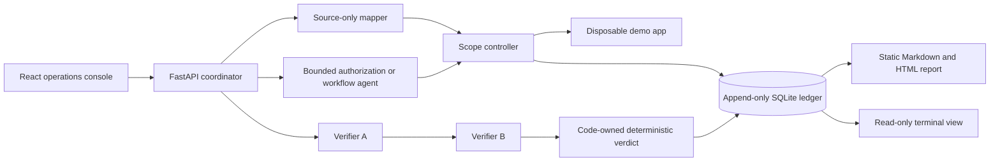

# Crack

**A contained, verification-first AI security lab for testing authorization and workflow boundaries against a disposable, developer-owned application.**

Crack explores a practical question: how can AI help plan security checks without letting model output decide scope, execute arbitrary actions, or declare its own findings?

The answer is a local-only pipeline where models propose bounded plans, ordinary code enforces every capability and verdict, and an append-only ledger preserves the evidence.

> **Safety boundary:** Crack is not a general scanner. It is built only for the included synthetic demo app, fixed loopback routes, fake accounts, and disposable data. Never point it at third-party or production systems.


_Real replay of an accepted synthetic run. Screenshot capture made no provider calls and did not modify the ledger._

## What this project demonstrates

- **Code-enforced containment:** agents receive no direct network, shell, filesystem, database, or credential access.
- **Bounded AI planning:** model output must pass strict schemas and fixed route, account, method, and call-count rules.
- **Independent verification:** two logical verifier roles reproduce a hypothesis sequentially from separate clean resets.
- **Deterministic decisions:** ordinary Python code owns evidence checks, consensus, verdicts, and verified-only finding creation.
- **Evidence integrity:** SQLite records append-only runs, events, hypothesis revisions, and findings.
- **Replayable presentation:** a React console streams allowlisted state transitions; reports render from exact completed ledger runs without rerunning providers.
- **Fail-closed behavior:** provider, schema, reset, execution, disagreement, or evidence-integrity failures cannot become successful findings.

## Recorded portfolio result

One accepted authorization run demonstrated the deliberately seeded flaw:

1. Account B listed its own record through the normal application flow.
2. Account A requested that exact record.
3. The vulnerable demo endpoint returned Account B's record with HTTP 200.
4. Two sequential, independently reset checks reproduced the same exact-record result.
5. Ordinary code marked the hypothesis `verified`, recorded one finding, and generated byte-stable Markdown and HTML reports.

This result applies only to the included synthetic application version and recorded reset snapshots. It is not a security certification or claim of complete coverage.


## Architecture



Logical roles run as sequential Python operations, not autonomous parallel services. All application access passes through the fixed scope controller.

## Evidence report

The standalone report leads with expected versus actual behavior, explains the reproduction in plain language, and keeps exact calls, reset IDs, hashes, and the complete event trail available through progressive disclosure. It contains static CSS only: no JavaScript, analytics, CDNs, or remote assets.


## Tech stack

- Python 3.11+ (3.12 in Docker), FastAPI, Pydantic, SQLite
- React 19, TypeScript, Vite, Vitest
- Docker Compose with loopback-only published ports
- Groq and Gemini through OpenAI-compatible clients for approved live runs
- Pytest, deterministic report rendering, SSE event replay

## Safe local tour

### Provider-free UI preview

This preview uses committed fixture events. It makes no provider calls and writes no ledger evidence.

```sh
cd frontend
npm ci
npm run dev
```

Open `http://127.0.0.1:4173/?preview=success`, then choose **Replay recorded preview**.

### Read existing evidence

These commands open the fixed repository-local ledger read-only and do not invoke agents or providers:

```sh
python -m ui.run_view --latest
python -m ui.run_view --run-id <run_id>

python -m reports.generate --latest
python -m reports.generate --run-id <verifier_run_id>
```

Reports are written to ignored `reports/output/`. Generation never changes ledger rows, findings, or verification statuses.

## Live contained demo

Live runs are optional, provider-backed, and intentionally narrow. Load Groq and Gemini credentials only through the ignored local environment file, then start the fixed loopback services:

```sh
docker compose up --build -d
cd frontend
npm run dev
```

Open `http://127.0.0.1:4173/` and choose **Start contained verification run**. The browser supplies no target, provider, credential, prompt, route, path, account, or model choice. Stop services afterwards:

```sh
docker compose down
```

CLI alternatives use the same fixed boundaries:

```sh
python -m coordinator.demo
python -m coordinator.workflow_demo
```

These commands make provider calls and append evidence to the local ledger. Exit code `0` means the complete fail-closed workflow produced one independently reproduced verified finding and byte-stable reports; incomplete or inconsistent runs are not presented as success. See [the recording runbook](docs/demo-runbook.md) before any live demo.

## Included synthetic test cases

### Cross-account record read

The demo app intentionally omits one ownership comparison on authenticated `GET /records/{id}`. Discovery uses Account B's normal `GET /records/mine` flow; reproduction then checks whether Account A can retrieve that exact Account B-owned record.

### Workflow approval bypass

The intended release sequence is `draft` to `approved` to `published`. The deliberate defect allows Account A to publish the seeded release directly from `draft`. The workflow agent can select only the contract-declared transition, and ordinary code submits a hypothesis only after observing the invalid state change.

## Verification

Current repository acceptance:

```sh
python -m pytest -q

cd frontend
npm test
npm run typecheck
npm run build

cd ..
docker compose config
git diff --check
```

- Python: **141 passed**
- Frontend: **19 passed**
- TypeScript check: passed
- Production build: passed
- Docker Compose configuration: passed

## Repository guide

- `app-under-test/` — disposable FastAPI app with fixed synthetic flaws and fixtures
- `scope-controller/` — sole gateway for source reads, loopback app calls, resets, and evidence writes
- `agents/` — mapper, router, identity, workflow, and verifier roles
- `coordinator/` — canonical workflows and live presentation API
- `ledger/` — schema, initialization, and read-only evidence boundary
- `reports/` — deterministic Markdown and standalone HTML renderer
- `frontend/` — React operations console
- `ui/` — deterministic terminal run view
- `docs/` — runbook, event contract, and portfolio screenshots

## Security and privacy

- Never commit provider credentials or `.env` files.
- Never use real accounts, records, prompts, secrets, or third-party data.
- Never widen the fixed loopback target or capability allowlists.
- Provider-backed runs send only bounded synthetic context declared by the role.
- Event journals, generated reports, databases, caches, and local build output remain ignored.
- Findings require complete evidence and code-owned verification; model prose alone is never sufficient.

See [AGENTS.md](AGENTS.md) for authoritative architecture decisions, containment rules, and sprint history.
