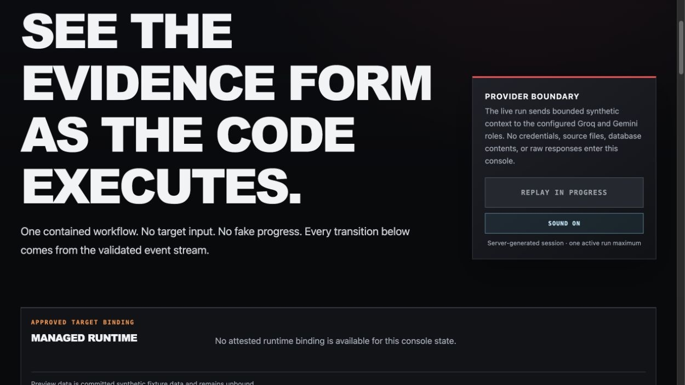
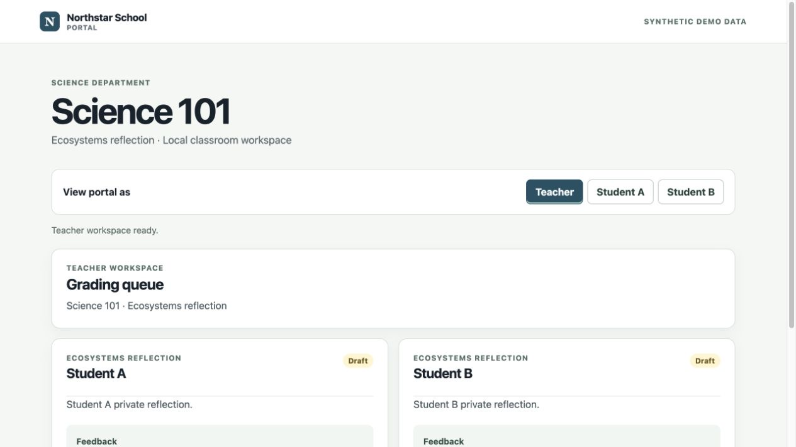
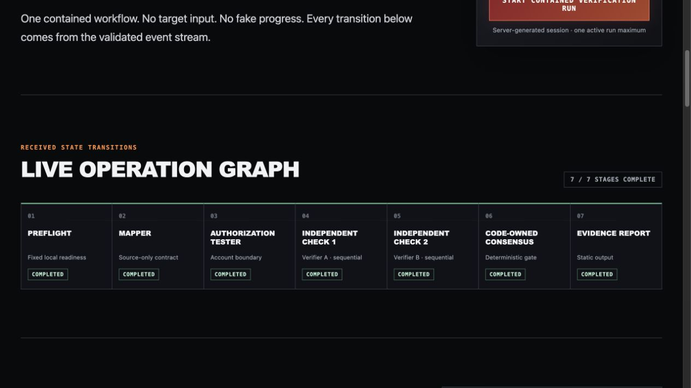
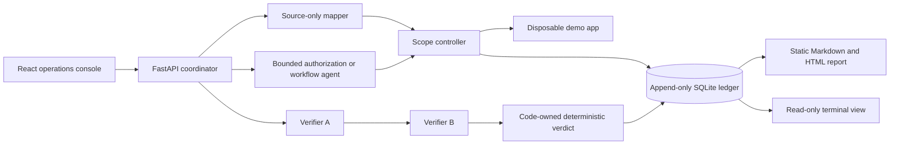
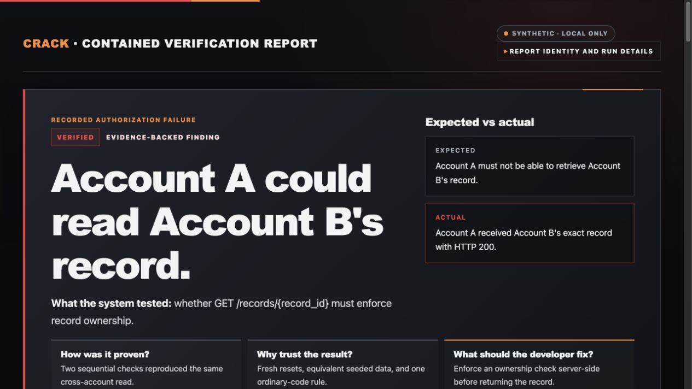

# Crack

**A contained, verification-first AI security lab for testing authorization and workflow boundaries against a disposable, developer-owned application.**

Crack explores a practical question: how can AI help plan security checks without letting model output decide scope, execute arbitrary actions, or declare its own findings?

The answer is a local-only pipeline where models propose bounded plans, ordinary code enforces every capability and verdict, and an append-only ledger preserves the evidence.

> **Safety boundary:** Crack is not a general scanner. It is built only for the included synthetic school portal, fixed loopback routes, synthetic Teacher/Student identities, and disposable data. Never point it at third-party or production systems.



_Provider-free replay of committed, accepted synthetic fixture events. Screenshot capture made no provider calls and did not modify the ledger._

## What this project demonstrates

- **Code-enforced containment:** agents receive no direct network, shell, filesystem, database, or credential access.
- **Bounded AI planning:** model output must pass strict schemas and fixed route, role, method, and call-count rules.
- **Independent verification:** two logical verifier roles reproduce a hypothesis sequentially from separate clean resets.
- **Deterministic decisions:** ordinary Python code owns evidence checks, consensus, verdicts, and verified-only finding creation.
- **Evidence integrity:** SQLite records append-only runs, events, hypothesis revisions, and findings.
- **Replayable presentation:** a React console streams allowlisted state transitions; reports render from exact completed ledger runs without rerunning providers.
- **Fail-closed behavior:** provider, schema, reset, execution, disagreement, or evidence-integrity failures cannot become successful findings.

## Sprint 14 migration status

The disposable target is now a deterministic school portal with Teacher, Student A, and Student B fixtures. Sprint 14 is validated offline only: no provider-backed or live workflow run is claimed. Historical ledger evidence remains preserved as evidence of its earlier fixture domain and is not a claim about the current portal state.





## Architecture



Logical roles run as sequential Python operations, not autonomous parallel services. All application access passes through the fixed scope controller.


The console overlays fixed canonical room labels, narrow orthogonal routes, four staging slots, and safe latest-event highlights on this local original environment. During an operator-started replay, four labeled 32 px sprite characters take finite, sequential, cardinal-only journeys and return to their own staging slots. The floor never claims a physical agent location, parallel execution, or a security verdict; tool effects, sound, and the final 48-second replay schedule remain separate Sprint 25 work.

## Evidence report

The standalone report leads with expected versus actual behavior, explains the reproduction in plain language, and keeps exact calls, reset IDs, hashes, and the complete event trail available through progressive disclosure. It contains static CSS only: no JavaScript, analytics, CDNs, or remote assets.



## Tech stack

- Python 3.11+ (3.12 in Docker), FastAPI, Pydantic, SQLite
- React 19, TypeScript, Vite, Vitest
- Docker Compose with loopback-only published ports
- Groq and Gemini through OpenAI-compatible clients for approved live runs
- Pytest, deterministic report rendering, SSE event replay

## Safe local tour

### School portal

The target application now has its own small, local school portal. It is separate from Crack's red-team operations console and uses only fixed synthetic data. Start the contained services, then open `http://127.0.0.1:8100` and choose Teacher, Student A, or Student B from the visible demo role switcher.

```sh
docker compose up --build -d
docker compose exec -T app-under-test python -m scripts.seed
```

Teacher can review or publish grades from the grading queue. Each student view uses only its normal `GET /submissions/mine` data, shows an explicit pending state until feedback is published, and never presents the other student's submission ID or content. Stop the services after local use:

```sh
docker compose down
```

### Offline target registration (Sprint 16)

Sprint 16 registers exactly one local target shape: the included synthetic school portal directory containing its strict `crack-target.json` and fixed `docker-compose.yml` descriptor. It does not support generic applications, remote targets, archives, Git clones, arbitrary compose settings, or runtime configuration.

First inspect the whole folder. This only validates regular files, fixed generated-directory exclusions, strict manifest fields, secret/database rejection, and prints safe metadata plus a deterministic snapshot hash:

```sh
python -m targets.add /absolute/path/to/app-under-test
```

Approve only the exact hash printed by that inspection:

```sh
python -m targets.add /absolute/path/to/app-under-test --approve-sha256 <exact_snapshot_sha256>
```

Activation reinspects the folder, fails if it changed, then atomically copies the approved tree into ignored `targets/registry/` and writes one ignored `active-target.json` document. Repeating the same approved snapshot is idempotent. This Sprint does **not** run Docker, execute imported commands, start the imported target, connect it to agents, call providers, or modify the ledger. Runtime handoff is deferred to Sprint 17.

### Approved runtime handoff (Sprint 17)

Sprint 17 can start only the active, hash-approved school-portal snapshot. It revalidates the active metadata, every snapshot file, its tree hash, and the canonical `Dockerfile` before every operation. It never reads a user-supplied Compose file or executes imported Compose settings.

The required image is deliberately a pre-existing **local-only** image named `crack-approved-school-portal-runtime:v1`. Its exact labels must bind `io.crack.runtime=sprint-17`, `io.crack.project=crack-approved-school-portal`, the active target ID, the approved snapshot SHA-256, and the canonical Dockerfile SHA-256. Before every start, Crack requires its immutable `sha256:<64-hex>` image ID and rechecks the tag before running that ID with Docker `--pull=never`. These labels are a trusted local operator assertion about image provenance, not cryptographic proof of image contents. Crack never builds, pulls, or pushes this image: the current source Dockerfile installs Python packages online, so offline image provisioning remains an explicit trusted local prerequisite.

After registration, use the exact approved hash:

```sh
python -m targets.runtime status
python -m targets.runtime start --approve-sha256 <exact_snapshot_sha256>
python -m targets.runtime stop
```

`start` owns one fixed non-attachable internal bridge network and one fixed container, publishes only `127.0.0.1:8100:8100`, uses a read-only root filesystem, `--user 65534:65534`, `--restart no`, dropped Linux capabilities, no-new-privileges, fixed limits, and only a bounded mode-`1777` tmpfs database directory. It runs the fixed `python -m scripts.seed` reset inside that verified image, then polls fixed loopback `/health`. Existing and newly created resources are fully re-inspected for their immutable image ID, exact inherited-plus-fixed environment, containment, network, and loopback binding before reuse or seed. It accepts no target, image, port, mount, environment, network, or command override. A failed start removes only resources it created in that attempt; if cleanup cannot verify or remove them, it reports incomplete rollback. `stop` acts only on fully matching resources.

This is still separate from the scope controller, mapper, agents, coordinator, and ledger. It changes no scope-controller origin or reset ownership and does not authorize a provider-backed workflow. The tmpfs database is intentionally discarded when this runtime stops. Runtime evidence is mocked/offline only: Crack has not executed Docker here, so the trusted local image must support the fixed numeric user and tmpfs reset contract before any separately authorized live check.

### Offline architecture map (Sprint 18)

Sprint 18 reads only the ignored active-target metadata and its exact approved registry snapshot. Before mapping, descriptor-pinned, non-following registry traversal revalidates the strict manifest and whole snapshot hash; metadata, registry, snapshots, and allowlisted source identities are checked again around analysis, so replacement races fail closed. It then uses constrained Python AST and fixed SQL-schema analysis only for the supported school portal; it never imports or executes target code and never reads target-controlled HTML or JavaScript labels.

```sh
python -m targets.architecture
python -m targets.architecture --write
```

The first command prints deterministic JSON. `--write` additionally atomically writes the same JSON to the fixed ignored path `targets/architecture-output/architecture.json`; there is no registry-root or output-path override. The frontend-ready graph identifies the static browser portal, FastAPI API, fixed role/authentication boundary, submissions, grade lifecycle domain, and SQLite persistence. It does not claim review-before-publish enforcement: the approved portal currently permits direct draft-to-published publication. Node and edge facts are source-derived; normalized coordinates are explicitly presentation-only layout.

This sprint does not execute Docker or Compose, run a target, call a provider, use credentials, contact a network service, invoke the scope controller, coordinator, agents, or ledger, write target or registry state, add event streaming, or add animation. It is not a generic repository mapper. Sprint 19 must be separately authorized for any presentation integration, streaming, animation, runtime handoff, or scope-controller ownership change.

### Event-related target map (Sprint 19)

Sprint 19 adds a frontend-only, static 2D target architecture map to the operations console. It mirrors the six canonical school-portal node IDs, labels, types, layers, coordinates, and nine edges from Sprint 18 in a fixed TypeScript graph. It does not read target files, registry state, architecture output, or an active runtime snapshot.

The existing validated presentation-event stream is the only map state source. The latest unique ordered event can relate to zero or more canonical components: mapper events relate to API structure; identity events relate to role authentication, submissions, and grade lifecycle; reset events relate to persistence; and verifier call events map only safe resolved `GET` route shapes. Coordinator, consensus, report, and session events can honestly remain outside the target map. The map never displays raw request bodies, paths, prompts, model output, source content, tokens, or private prose.

This highlighting is a presentation relationship, not a physical-process location, active imported-runtime binding, attack effect, or proof of attack activity. It has no timers, animation, transitions, fake progress, provider calls, Docker activity, target execution, or ledger writes. Preview and reconnect replay use only recorded fixture events and deterministically show one current sequential verifier role. Sprint 20 may separately consider motion or attack effects; Sprint 21 owns active imported-runtime binding and broader integration.

### Finite event-tied tool markers (Sprint 20)

Sprint 20 adds one restrained, finite presentation marker to the existing static map. An active mapper event can show a scan, active identity events a probe, an active safe Verifier A call a pickaxe, and an active safe Verifier B call a beam; coordinator, consensus, report, non-active, and unsafe-route events remain static actor markers. The pure, exhaustive event-to-effect mapping reuses the latest unique ordered accepted or replayed event and its existing safe component relation. It derives a relation from allowlisted route metadata but never renders raw event metadata, so paths, body hashes, prompts, source, tokens, IDs, and private prose remain absent.

Markers are presentation-only visual language, not a claim that an agent is physically inside a component, that an attack happened, or that it succeeded. Each motion runs once and is keyed by real event sequence; there are no timers, random choices, background loops, fake progress, or parallel verifier markers. State is shown with text and symbols, and reduced-motion users receive the same labels and static iconography with no transform or opacity movement. Verified findings still come only from code-owned consensus. Sprint 20 does not change the event schema, coordinator, target, runtime, scope controller, agents, Docker behavior, provider boundary, registry, or ledger. Sprint 21 remains responsible for any active imported-runtime binding or broader integration.

### Managed runtime binding (Sprint 21)

Sprint 21 adds a separate host-local runtime-console mode for exactly one active approved school-portal snapshot and an already-running Sprint 17 managed runtime. The default `coordinator.demo`, root Compose topology, workflow demo, and scope-controller source/reset behavior remain unchanged. The runtime mode injects only three ordinary callables into the existing mapper, identity, and verifier APIs: non-following approved-snapshot source reads, the unchanged fixed loopback endpoint caller, and a managed reset.

Each injected operation revalidates the captured active descriptor and the exact label-bound managed container. Resets re-inspect immediately before the fixed image-owned seed command, health-check afterwards, and return only a deterministic 16-character logical-state fingerprint derived inside the container; no fixture rows or tokens cross the Docker adapter. Runtime/architecture attestation occurs before provider client construction and publishes only target ID, approved registration hash, `running` status, and source-derived provenance. The console displays those facts only after an exact completed preflight event; preview remains committed synthetic fixture data and unbound. Offline Sprint 21 work does not start Docker, run providers, change the ledger, or make a security verdict.

### Operations floor and bounded journeys (Sprints 23–24)

Sprint 23 replaces the old diagram canvas with one fixed 960×540 top-down floor. Six themed stations mirror the safe canonical portal graph, nine authored dotted routes use horizontal and vertical segments only, and Mapper, Authorization Tester, Verifier A, and Verifier B remain labeled in the staging dock. Geometry and labels are committed presentation data; events can highlight only the already allowlisted room relations. The original background and its provenance are local, with no CDN or copied commercial-game asset.

Sprint 24 adds four original local eight-frame sprite sheets and one deterministic frontend animation director. Only fixed allowlisted events can select a fixed role, room, and authored route. The director keeps one role active at a time, requires an executed safe verifier call before verifier movement, holds Verifier B until Verifier A returns, cancels stale work on restart or unmount, and presents a fixed status instead of movement when reduced motion is requested. The initial completed preview remains staged; movement begins only after the existing replay or run control is used.

The movement layer adds no tool attack effects, sound, replay retiming, backend change, provider call, Docker action, or ledger write. Sprite clipping, cardinal paths, local provenance, and safe captions are code-owned; verified findings still come only from ordinary consensus code.

### Provider-free UI preview

This preview uses committed fixture events. It makes no provider calls and writes no ledger evidence.

```sh
cd frontend
npm ci
npm run dev
```

Open `http://127.0.0.1:4173/?preview=success`, then choose **Replay recorded preview**. The committed events replay one at a time so stage activation, sequential verifier roles, room relations, and bounded character journeys remain visible; replay makes no provider calls or ledger writes.

### Read existing evidence

These commands open the fixed repository-local ledger read-only and do not invoke agents or providers:

```sh
python -m ui.run_view --latest
python -m ui.run_view --run-id <run_id>

python -m reports.generate --latest
python -m reports.generate --run-id <verifier_run_id>
```

Reports are written to ignored `reports/output/`. Generation never changes ledger rows, findings, or verification statuses.

### Imported-runtime console

This is a separate, optional live path; it does not replace the default demo below. Stop the root Compose stack first so only the managed runtime owns loopback port `8100`. After separately registering the exact local school-portal folder and preparing the trusted local image described above, an operator may start the approved hash and fixed host-local coordinator:

```sh
python -m targets.runtime start --approve-sha256 <exact_snapshot_sha256>
python -m coordinator.runtime_main
```

In another terminal, start the frontend and open `http://127.0.0.1:4173/`:

```sh
cd frontend
npm run dev
```

The runtime command never builds or pulls an image. Image labels are local operator assertions, not cryptographic proof of image contents. Starting a console workflow remains provider-backed and requires the same ignored local provider environment plus explicit live-run approval. Stop the coordinator and frontend with `Ctrl-C`, then stop only the fixed label-matched runtime:

```sh
python -m targets.runtime stop
```

## Live contained demo

Live runs are optional, provider-backed, and intentionally narrow. Load Groq and Gemini credentials only through the ignored local environment file, then start the fixed loopback services:

```sh
docker compose up --build -d
cd frontend
npm run dev
```

Open `http://127.0.0.1:4173/` and choose **Start contained verification run**. The browser supplies no target, provider, credential, prompt, route, path, synthetic role, or model choice. Stop services afterwards:

```sh
docker compose down
```

CLI alternatives use the same fixed boundaries:

```sh
python -m coordinator.demo
python -m coordinator.workflow_demo
```

These commands make provider calls and append evidence to the local ledger. Exit code `0` means the complete fail-closed workflow produced one independently reproduced verified finding and byte-stable reports; incomplete or inconsistent runs are not presented as success. See [the recording runbook](docs/demo-runbook.md) before any live demo.

## Included synthetic test cases

### Cross-student submission and grade detail read

The demo app intentionally omits one student-owner comparison on authenticated `GET /submissions/{submission_id}/grade`. Discovery uses Student B's normal `GET /submissions/mine` flow; reproduction then checks whether Student A can retrieve that exact Student B-owned submission and grade detail.

### Grade-review bypass

The intended grade sequence is `draft` to `reviewed` to `published`. The deliberate defect allows the fixed Teacher to publish a seeded grade directly from `draft`. The workflow agent can select only the contract-declared transition, and ordinary code submits a hypothesis only after observing the invalid state change.

## Verification

Current repository acceptance:

```sh
python -m pytest -q

cd frontend
npm test
npm run typecheck
npm run build

cd ..
docker compose config
git diff --check
```

- Python: **263 passed, 1 warning**
- Frontend: **40 tests passed**; TypeScript check and production build: passed
- Docker Compose configuration: passed

## Repository guide

- `app-under-test/` — disposable FastAPI app with fixed synthetic flaws and fixtures
- `scope-controller/` — sole gateway for source reads, loopback app calls, resets, and evidence writes
- `agents/` — mapper, router, identity, workflow, and verifier roles
- `coordinator/` — canonical workflows and live presentation API
- `ledger/` — schema, initialization, and read-only evidence boundary
- `reports/` — deterministic Markdown and standalone HTML renderer
- `frontend/` — React operations console
- `ui/` — deterministic terminal run view
- `targets/` — strict registration plus fixed, hash-bound local runtime handoff
- `docs/` — runbook, event contract, and portfolio screenshots

## Security and privacy

- Never commit provider credentials or `.env` files.
- Never use real identities, student submissions, grades, prompts, secrets, or third-party data.
- Never widen the fixed loopback target or capability allowlists.
- Provider-backed runs send only bounded synthetic context declared by the role.
- Event journals, generated reports, databases, caches, and local build output remain ignored.
- Target registry snapshots and active-target metadata remain ignored; registration never executes sources, and runtime accepts only a separately approved snapshot plus verified local image.
- Findings require complete evidence and code-owned verification; model prose alone is never sufficient.

See [AGENTS.md](AGENTS.md) for authoritative architecture decisions, containment rules, and sprint history.
