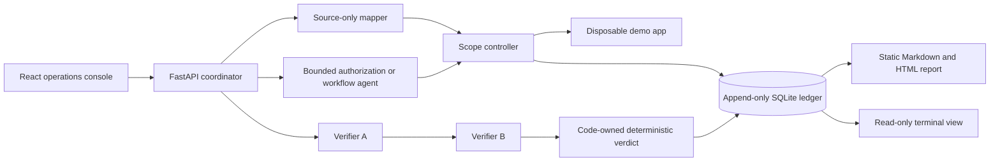

# Crack

**A contained, verification-first AI security lab for testing authorization and workflow boundaries against a disposable, developer-owned application.**

Crack explores a practical question: how can AI help plan security checks without letting model output decide scope, execute arbitrary actions, or declare its own findings?

The answer is a local-only pipeline where models propose bounded plans, ordinary code enforces every capability and verdict, and an append-only ledger preserves the evidence.

> **Safety boundary:** Crack is not a general scanner. It is built only for the included synthetic school portal, fixed loopback routes, synthetic Teacher/Student identities, and disposable data. Never point it at third-party or production systems.


_Real replay of an accepted synthetic run. Screenshot capture made no provider calls and did not modify the ledger._

## What this project demonstrates

- **Code-enforced containment:** agents receive no direct network, shell, filesystem, database, or credential access.
- **Bounded AI planning:** model output must pass strict schemas and fixed route, role, method, and call-count rules.
- **Independent verification:** two logical verifier roles reproduce a hypothesis sequentially from separate clean resets.
- **Deterministic decisions:** ordinary Python code owns evidence checks, consensus, verdicts, and verified-only finding creation.
- **Evidence integrity:** SQLite records append-only runs, events, hypothesis revisions, and findings.
- **Replayable presentation:** a React console streams allowlisted state transitions; reports render from exact completed ledger runs without rerunning providers.
- **Fail-closed behavior:** provider, schema, reset, execution, disagreement, or evidence-integrity failures cannot become successful findings.

## Sprint 14 migration status

The disposable target is now a deterministic school portal with Teacher, Student A, and Student B fixtures. Sprint 14 is validated offline only: no provider-backed or live workflow run is claimed. Historical ledger evidence remains preserved as evidence of its earlier fixture domain and is not a claim about the current portal state.


## Architecture



Logical roles run as sequential Python operations, not autonomous parallel services. All application access passes through the fixed scope controller.

## Evidence report

The standalone report leads with expected versus actual behavior, explains the reproduction in plain language, and keeps exact calls, reset IDs, hashes, and the complete event trail available through progressive disclosure. It contains static CSS only: no JavaScript, analytics, CDNs, or remote assets.


## Tech stack

- Python 3.11+ (3.12 in Docker), FastAPI, Pydantic, SQLite
- React 19, TypeScript, Vite, Vitest
- Docker Compose with loopback-only published ports
- Groq and Gemini through OpenAI-compatible clients for approved live runs
- Pytest, deterministic report rendering, SSE event replay

## Safe local tour

### School portal

The target application now has its own small, local school portal. It is separate from Crack's red-team operations console and uses only fixed synthetic data. Start the contained services, then open `http://127.0.0.1:8100` and choose Teacher, Student A, or Student B from the visible demo role switcher.

```sh
docker compose up --build -d
docker compose exec -T app-under-test python -m scripts.seed
```

Teacher can review or publish grades from the grading queue. Each student view uses only its normal `GET /submissions/mine` data, shows an explicit pending state until feedback is published, and never presents the other student's submission ID or content. Stop the services after local use:

```sh
docker compose down
```

### Offline target registration (Sprint 16)

Sprint 16 registers exactly one local target shape: the included synthetic school portal directory containing its strict `crack-target.json` and fixed `docker-compose.yml` descriptor. It does not support generic applications, remote targets, archives, Git clones, arbitrary compose settings, or runtime configuration.

First inspect the whole folder. This only validates regular files, fixed generated-directory exclusions, strict manifest fields, secret/database rejection, and prints safe metadata plus a deterministic snapshot hash:

```sh
python -m targets.add /absolute/path/to/app-under-test
```

Approve only the exact hash printed by that inspection:

```sh
python -m targets.add /absolute/path/to/app-under-test --approve-sha256 <exact_snapshot_sha256>
```

Activation reinspects the folder, fails if it changed, then atomically copies the approved tree into ignored `targets/registry/` and writes one ignored `active-target.json` document. Repeating the same approved snapshot is idempotent. This Sprint does **not** run Docker, execute imported commands, start the imported target, connect it to agents, call providers, or modify the ledger. Runtime handoff is deferred to Sprint 17.

### Provider-free UI preview

This preview uses committed fixture events. It makes no provider calls and writes no ledger evidence.

```sh
cd frontend
npm ci
npm run dev
```

Open `http://127.0.0.1:4173/?preview=success`, then choose **Replay recorded preview**.

### Read existing evidence

These commands open the fixed repository-local ledger read-only and do not invoke agents or providers:

```sh
python -m ui.run_view --latest
python -m ui.run_view --run-id <run_id>

python -m reports.generate --latest
python -m reports.generate --run-id <verifier_run_id>
```

Reports are written to ignored `reports/output/`. Generation never changes ledger rows, findings, or verification statuses.

## Live contained demo

Live runs are optional, provider-backed, and intentionally narrow. Load Groq and Gemini credentials only through the ignored local environment file, then start the fixed loopback services:

```sh
docker compose up --build -d
cd frontend
npm run dev
```

Open `http://127.0.0.1:4173/` and choose **Start contained verification run**. The browser supplies no target, provider, credential, prompt, route, path, synthetic role, or model choice. Stop services afterwards:

```sh
docker compose down
```

CLI alternatives use the same fixed boundaries:

```sh
python -m coordinator.demo
python -m coordinator.workflow_demo
```

These commands make provider calls and append evidence to the local ledger. Exit code `0` means the complete fail-closed workflow produced one independently reproduced verified finding and byte-stable reports; incomplete or inconsistent runs are not presented as success. See [the recording runbook](docs/demo-runbook.md) before any live demo.

## Included synthetic test cases

### Cross-student submission and grade detail read

The demo app intentionally omits one student-owner comparison on authenticated `GET /submissions/{submission_id}/grade`. Discovery uses Student B's normal `GET /submissions/mine` flow; reproduction then checks whether Student A can retrieve that exact Student B-owned submission and grade detail.

### Grade-review bypass

The intended grade sequence is `draft` to `reviewed` to `published`. The deliberate defect allows the fixed Teacher to publish a seeded grade directly from `draft`. The workflow agent can select only the contract-declared transition, and ordinary code submits a hypothesis only after observing the invalid state change.

## Verification

Current repository acceptance:

```sh
python -m pytest -q

cd frontend
npm test
npm run typecheck
npm run build

cd ..
docker compose config
git diff --check
```

- Python: **188 passed, 1 warning**
- Frontend: **19 passed**
- TypeScript check: passed
- Production build: passed
- Docker Compose configuration: passed

## Repository guide

- `app-under-test/` — disposable FastAPI app with fixed synthetic flaws and fixtures
- `scope-controller/` — sole gateway for source reads, loopback app calls, resets, and evidence writes
- `agents/` — mapper, router, identity, workflow, and verifier roles
- `coordinator/` — canonical workflows and live presentation API
- `ledger/` — schema, initialization, and read-only evidence boundary
- `reports/` — deterministic Markdown and standalone HTML renderer
- `frontend/` — React operations console
- `ui/` — deterministic terminal run view
- `targets/` — strict offline manifest validation, tree inspection/hash plans, and approved snapshot registry
- `docs/` — runbook, event contract, and portfolio screenshots

## Security and privacy

- Never commit provider credentials or `.env` files.
- Never use real identities, student submissions, grades, prompts, secrets, or third-party data.
- Never widen the fixed loopback target or capability allowlists.
- Provider-backed runs send only bounded synthetic context declared by the role.
- Event journals, generated reports, databases, caches, and local build output remain ignored.
- Target registry snapshots and active-target metadata remain ignored; source folders are inspected only, never executed by registration.
- Findings require complete evidence and code-owned verification; model prose alone is never sufficient.

See [AGENTS.md](AGENTS.md) for authoritative architecture decisions, containment rules, and sprint history.
